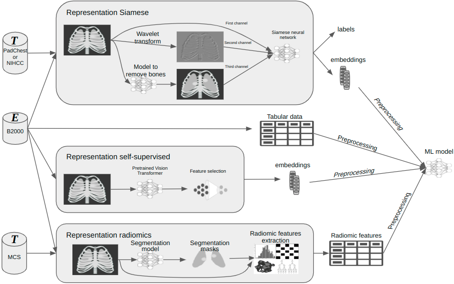

# X-ray Transferable Polyrepresentation Learning

[](https://www.python.org/)
[](https://pytorch.org/)
[](https://opencv.org/)
[](https://github.com/psf/black)
[](https://arxiv.org/abs/TODO)


## Key Features

🔗 **Polyrepresentation Concept:** Explore the innovative concept of polyrepresentation, which seamlessly combines multiple representations from various models, perspectives or data sources to enhance machine learning performance.

🌐 **Transferability:** Discover how the created polyrepresentation can be effectively transferred to smaller datasets, demonstrating its potential as a practical and efficient solution for various image-related tasks.

🔬 **Multi-Faceted Approach:** Address classification problems comprehensively by leveraging multiple representations, including vector embeddings from Siamese Network, DINOv2 self-supervised learning, and interpretable radiomic features.

📈 **Performance Boost:** Learn how polyrepresentation consistently outperforms single-model approaches, leading to improved results across different tasks and datasets.

🌍 **Versatility:** While initially applied to X-ray images, polyrepresentation's versatility makes it adaptable to diverse domains, offering a novel perspective on data representation.




## Installation

To set up the required packages using Conda, you can create a Conda environment and install the necessary dependencies as follows:

1. Clone the repository:
   ```shell
   git clone https://github.com/Hryniewska/polyrepresentation.git
   cd polyrepresentation
   ```

2. Create a Conda environment:
   ```shell
   conda create -n polyenv python=3.9
   ```

4. Activate the conda environment:
   ```shell
   conda activate polyenv
   ```
5. Install the required packages using conda:
   ```shell
   conda install matplotlib scikit-learn xgboost joblib seaborn PyWavelets pytorch torchvision -c pytorch
   conda install timm neptune-client albumentations -c conda-forge
   ```
7. Install the remaining packages via pip:
   ```shell
   pandas>=2.1.0
   numpy>=1.24.4
   xgboost>=1.7.6
   dalex>=1.5.0
   opencv-python>=4.7.0
   PyWavelets>=1.3.0
   torch>=1.12.0
   timm>=0.4.12
   ```

## Getting Started

To get started with this project, follow these files:

- For training own Siamese Network, use: [**Siamese_Network_training.ipynb**](Siamese_Network_training.ipynb)

- For creating polyrepresentation, use: [**polyrepresentation_training.ipynb**](polyrepresentation_training.ipynb)


## Reference

If you find our work useful, please cite our paper:

```
@article{Hryniewskapolyrepresentation,
	title={X-ray transferable polyrepresentation learning}, 
	author={Weronika Hryniewska and Przemys{\l}aw Biecek},
	journal = {preprint},
	year={2023}
}
